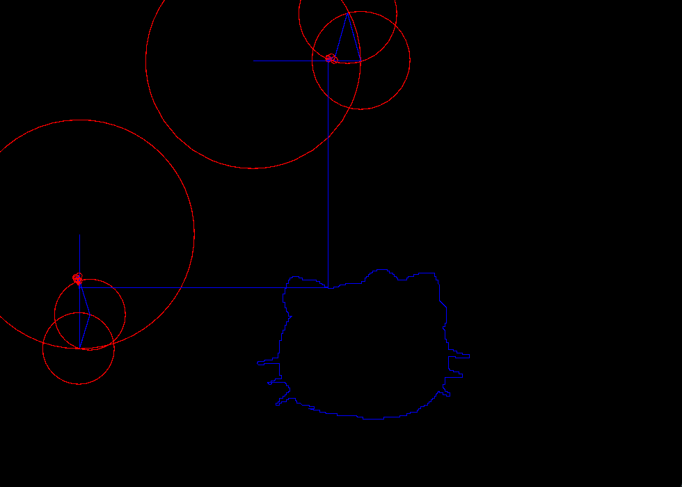

# Fourier Transform

## Features

- made in Java(yes for a guy as me who makes something in Java for the first time it is a feature)

###  nothing special it was just an experiment to see how hard it would be to make it in Java and how long will it take. But still I have lerned a couple of things on the way, now I have gotten used to Java more and in overal the algorythm is peculiar. [this video was also pretty helpful](https://www.youtube.com/watch?v=MY4luNgGfms&ab_channel=TheCodingTrain)

## I tried to draw hello kitty but then I understood how time-comsuming it will be so I ended up having only the outline

